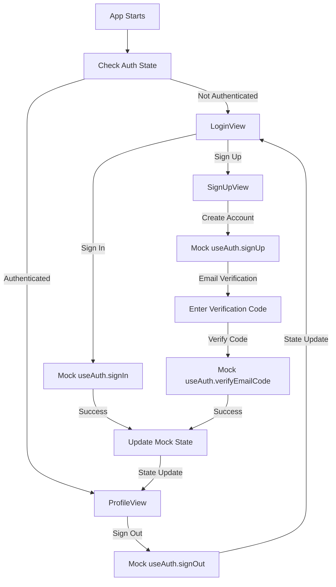

# Ionic Vue Clerk Tutorial - Starting Point

A clean Ionic Vue application designed as a **tutorial starting point** for learning how to integrate Clerk authentication. This app provides a basic foundation with mock authentication that you'll replace with real Clerk functionality during the tutorial.

> **🚀 Quick Start**: This is the `main` branch - the tutorial starting point. For the completed implementation with real Clerk integration, check out the `finished-code` branch.

## 📋 Current Code State

This branch contains **intentionally basic code** designed for learning:

### **What's Included (Mock Implementation)**
- **Basic UI Components** - Login, signup, and profile views with Ionic components
- **Mock Authentication** - Simple functions that simulate auth behavior
- **Basic Routing** - Simple router setup without authentication guards
- **Tutorial Structure** - Clean, minimal codebase ready for enhancement
- **Basic Documentation** - Simple comments explaining the tutorial purpose

### **What's NOT Included (Tutorial Goals)**
- **Real Clerk Integration** - You'll add this during the tutorial
- **Authentication Guards** - You'll implement route protection
- **Session Management** - You'll add real session handling
- **Error Handling** - You'll implement comprehensive error handling
- **Loading States** - You'll add Suspense and loading components
- **JSDoc Documentation** - You'll add comprehensive documentation
- **TypeScript Type Safety** - You'll improve type definitions

## 🌿 Branch Structure

This repository contains two main branches with different levels of completion:

### **`main` Branch - Tutorial Starting Point**
The main branch contains the **tutorial starting point** with:
- **Mock Authentication** - Simulated authentication for learning purposes
- **Basic UI Components** - Login, signup, and profile views
- **Tutorial Structure** - Clean foundation for following the tutorial
- **Mock Composables** - Simple authentication functions to be replaced
- **Basic Documentation** - Tutorial-focused README and comments

**Use this branch when:**
- Starting the tutorial from scratch
- Learning Clerk integration step-by-step
- Following the tutorial guide

### **`finished-code` Branch - Completed Implementation**
The finished-code branch contains the **completed tutorial** with:
- **Real Clerk Integration** - Production-ready authentication service
- **Comprehensive JSDoc** - Every function and component fully documented
- **TypeScript Type Safety** - Zero `any` types, full type coverage
- **Mobile Optimization** - Capacitor-ready for iOS and Android
- **Suspense Support** - Async component loading with proper fallback states
- **Session Management** - Real session refresh and state management
- **Error Handling** - Proper error handling throughout the application

**Use this branch when:**
- You want to see the final result
- You need a reference implementation
- You want to skip the tutorial and use the completed code

### **Switching Between Branches**

```bash
# Switch to tutorial starting point
git checkout main

# Switch to completed implementation
git checkout finished-code

# See what's different between branches
git diff main..finished-code
```

### **Getting Started**

**For Tutorial Learning:**
1. Start on the `main` branch (you're already here!)
2. Follow the tutorial step-by-step
3. Replace mock functions with real Clerk integration
4. Add comprehensive documentation and error handling

**For Production Use:**
1. Switch to the `finished-code` branch
2. Set up your Clerk publishable key in `.env`
3. Run `npm install` and `npm run dev`
4. You have a production-ready app with full Clerk integration

**For Reference:**
- Use `finished-code` branch as a reference while following the tutorial
- Compare your progress with the completed implementation
- See examples of proper JSDoc documentation and TypeScript usage

### **Branch History**

The repository was structured this way to support both tutorial learning and production use:

1. **Original Development**: The tutorial was completed on the main branch
2. **Branch Creation**: A `finished-code` branch was created to preserve the completed work
3. **Main Reset**: The main branch was reset to the tutorial starting point
4. **Current State**: 
   - `main` = Clean tutorial starting point
   - `finished-code` = Completed implementation with all improvements

This allows new users to start fresh with the tutorial while keeping the completed work available for reference or immediate use.

## 🚀 Current Features (Tutorial Starting Point)

### **Mock Authentication System**
- **Login View** - Basic sign-in form (no real authentication yet)
- **Sign Up View** - Basic registration form (no real validation yet)
- **Profile View** - Basic profile display (shows mock user data)
- **Auth Actions** - Basic buttons for testing (no real functionality yet)
- **No Route Protection** - All routes are currently accessible

### **Basic Technical Setup**
- **Vue 3** - Modern reactive framework with Composition API
- **Ionic Vue** - Mobile-first UI framework with native components
- **TypeScript** - Basic type setup (will be enhanced during tutorial)
- **Vite** - Fast build tool and development server
- **Mock Composables** - Simple functions that return mock data

### **Tutorial-Ready Structure**
- **Clean Codebase** - Minimal, easy-to-understand code
- **Clear Comments** - Basic documentation explaining tutorial purpose
- **Modular Design** - Components and composables ready for enhancement
- **No Dependencies** - No external auth libraries (you'll add Clerk)

## 🛠️ Tech Stack

- **Vue 3** - Progressive JavaScript framework
- **Ionic Vue** - Mobile-first UI framework
- **TypeScript** - Type-safe JavaScript development
- **Vite** - Fast build tool and development server

## 📱 Platforms

- **Web** - Modern browsers (Chrome, Firefox, Safari, Edge)
- **iOS** - Native iOS app via Capacitor (iOS 13+)
- **Android** - Native Android app via Capacitor (API 21+)

## 🚀 Quick Start

### Prerequisites

- **Node.js** 18+ 
- **npm** or **yarn**

### Installation

1. **Install dependencies**
   ```bash
   npm install
   ```

2. **Set up environment variables (for Clerk integration)**
   ```bash
   cp .env.example .env
   # Edit .env with your Clerk publishable key when ready to integrate
   ```

3. **Run the development server**
   ```bash
   npm run dev
   ```

4. **Open in browser**
   - Navigate to `http://localhost:3000`
   - Test the mock authentication flow

## 🏗️ Project Architecture

### **Current Project Structure (Tutorial Starting Point)**

```
src/
├── main.ts                    # Basic app entry point (no Clerk setup yet)
├── App.vue                    # Simple root component (no auth logic yet)
├── components/
│   ├── AuthActions.vue        # Basic buttons (no real functionality)
│   └── LoadingSpinner.vue     # Basic loading component
├── composables/
│   ├── useAuth.ts             # Mock authentication functions
│   └── useMobileAuth.ts       # Mock mobile features
├── lib/
│   ├── auth.ts                # Simple auth exports
│   └── README.md              # Auth library documentation
├── views/
│   ├── LoginView.vue          # Basic login form (no real auth)
│   ├── SignUpView.vue         # Basic signup form (no real validation)
│   └── ProfileView.vue        # Basic profile display (mock data)
├── router/
│   └── auth.ts                # Basic router (no auth guards)
└── theme/
    └── variables.css          # Ionic theme variables
```

### **What Each File Contains (Current State)**

- **`main.ts`** - Basic Vue app setup, no Clerk integration
- **`App.vue`** - Simple router outlet, no authentication logic
- **`useAuth.ts`** - Mock functions that always return false/success
- **`useMobileAuth.ts`** - Mock mobile detection functions
- **Views** - Basic forms with no real validation or authentication
- **Router** - Simple routing without authentication guards
- **Components** - Basic UI components with placeholder functionality

### Mock Authentication Flow



## 🧪 Testing the Current Mock Implementation

### **What You Can Test Now (Mock Behavior)**

1. **Basic Navigation**
   - Navigate between `/login`, `/signup`, and `/profile`
   - All routes are currently accessible (no auth guards yet)

2. **Form Interactions**
   - Fill out login and signup forms
   - Click buttons (they won't actually authenticate yet)
   - See basic form validation (client-side only)

3. **UI Components**
   - Test Ionic components and styling
   - See responsive design on different screen sizes
   - Test basic user interactions

### **What You CAN'T Test Yet (Tutorial Goals)**

1. **Real Authentication** - Forms don't actually sign users in/out
2. **Route Protection** - All routes are accessible without authentication
3. **Session Management** - No real user sessions or state persistence
4. **Error Handling** - No real error states or user feedback
5. **Loading States** - No loading indicators during operations

### **Mock Behavior Notes**

- **All forms return success** - Mock functions always return `true`
- **No real validation** - Forms accept any input
- **No persistence** - Page refresh resets all state
- **No real user data** - Profile shows placeholder information

**This is intentional!** The tutorial will teach you how to replace these mock functions with real Clerk authentication.

## 🔧 Development

### Available Scripts

```bash
# Development server
npm run dev

# Build for production
npm run build

# Preview production build
npm run preview

# Lint code
npm run lint
```

### **Current Mock Authentication Composable**

The `useAuth` composable currently provides **mock functionality only**:

```typescript
import { useAuth } from './composables/useAuth';

const {
  // State (Mock)
  isSignedIn,    // Computed: always false (mock)
  user,          // Computed: null (mock)
  isLoaded,      // Computed: always true (mock)
  isLoading,     // Computed: always false (mock)
  error,         // Computed: empty string (mock)
  
  // Methods (Mock - Always Return Success)
  signIn,        // Mock: always returns true
  signUp,        // Mock: always returns true
  signOut,       // Mock: always returns true
  handleVerification, // Mock: always returns true
  getUserProfile, // Mock: returns null
  getSession,    // Mock: returns null
  refreshSession, // Mock: always returns true
} = useAuth();
```

### **Mock Behavior Explanation**

- **All methods return success** - This is intentional for tutorial purposes
- **No real state management** - State doesn't persist between page refreshes
- **No real validation** - Forms accept any input
- **No error handling** - No real error states or user feedback

**During the tutorial, you'll replace these mock functions with real Clerk integration!**

## 📚 Tutorial Expectations

### **What You'll Learn**
1. **Clerk Integration** - How to set up and configure Clerk authentication
2. **Real Authentication** - Replace mock functions with real auth logic
3. **Route Protection** - Implement authentication guards and navigation
4. **Session Management** - Handle user sessions and state persistence
5. **Error Handling** - Add comprehensive error handling and user feedback
6. **Loading States** - Implement Suspense and loading components
7. **Documentation** - Add JSDoc comments and improve TypeScript types
8. **Mobile Optimization** - Prepare for Capacitor deployment

### **Tutorial Progression**
- **Start Here** - This clean, basic codebase
- **Follow Steps** - Replace mock functions one by one
- **Test Progress** - See real authentication working
- **Add Features** - Enhance with error handling and loading states
- **Complete** - End up with production-ready code like `finished-code` branch

### **Reference Implementation**
- Use the `finished-code` branch as a reference
- Compare your progress with the completed implementation
- See examples of proper JSDoc documentation and TypeScript usage

## 🔧 Environment Configuration

### .env File Setup

The project includes a `.env.example` file with all necessary environment variables for Clerk integration:

```bash
# Copy the example file
cp .env.example .env

# Required: Clerk publishable key (get from https://dashboard.clerk.com/)
VITE_CLERK_PUBLISHABLE_KEY=pk_test_your_publishable_key_here

# Optional: Custom URLs and domains
VITE_CLERK_DOMAIN=your-custom-domain.clerk.accounts.dev
VITE_CLERK_SIGN_IN_URL=/login
VITE_CLERK_SIGN_UP_URL=/signup
VITE_CLERK_AFTER_SIGN_IN_URL=/profile
VITE_CLERK_AFTER_SIGN_UP_URL=/profile
```

**Important Notes:**
- Use `VITE_` prefix for environment variables (Vite requirement)
- Never commit `.env` files (they're in `.gitignore`)
- Restart dev server after changing environment variables
- Use `pk_test_` keys for development, `pk_live_` for production

## 📚 Next Steps

This tutorial app is designed to be the starting point for learning Clerk integration. Follow the tutorial to:

1. **Install Clerk** - Add Clerk dependencies
2. **Configure Clerk** - Set up authentication service
3. **Replace Mock Auth** - Swap mock functions for real Clerk
4. **Add Email Code Verification** - Implement real email verification (mobile-friendly)
5. **Add Suspense** - Implement production-ready loading states

## 🔍 Branch Comparison

### **Key Differences Between Branches**

| Feature | `main` Branch | `finished-code` Branch |
|---------|---------------|------------------------|
| **Authentication** | Mock functions | Real Clerk integration |
| **Documentation** | Basic comments | Comprehensive JSDoc |
| **TypeScript** | Basic types | Full type safety, zero `any` |
| **Error Handling** | Basic | Comprehensive error handling |
| **Loading States** | Basic | Suspense with fallback components |
| **Session Management** | Mock | Real Clerk session management |
| **Mobile Features** | Basic | Full Capacitor optimization |
| **Code Quality** | Tutorial level | Production ready |

### **File Structure Differences**

**Main Branch:**
```
src/
├── components/
│   └── AuthActions.vue        # Basic mock actions
├── composables/
│   ├── useAuth.ts             # Mock authentication
│   └── useMobileAuth.ts       # Mock mobile features
└── views/
    ├── LoginView.vue          # Basic login form
    ├── SignUpView.vue         # Basic signup form
    └── ProfileView.vue        # Basic profile display
```

**Finished-Code Branch:**
```
src/
├── components/
│   ├── AppContent.vue         # Router with auth protection
│   ├── AuthActions.vue        # Enhanced auth actions
│   └── LoadingSpinner.vue     # Loading state component
├── composables/
│   ├── useAuth.ts             # Real Clerk integration
│   └── useMobileAuth.ts       # Enhanced mobile features
├── lib/
│   └── auth.ts                # Auth library exports
└── views/
    ├── LoginView.vue          # Enhanced with real auth
    ├── SignUpView.vue         # Enhanced with verification
    └── ProfileView.vue        # Enhanced with real user data
```

**Why Email Codes vs Email Links?**
- ✅ **Mobile-friendly** - Works seamlessly with Capacitor and mobile apps
- ✅ **No cross-origin issues** - Avoids `capacitor://localhost` vs `https://` protocol conflicts
- ✅ **Copy/paste friendly** - Users can easily copy codes from email
- ✅ **Offline capable** - Works once code is received, no browser dependency

## 🐛 Troubleshooting

### Common Issues

1. **App not loading**
   - Check if all dependencies are installed: `npm install`
   - Ensure Node.js version is 18+
   - Check browser console for any errors

2. **Forms not working as expected**
   - **This is normal!** Forms are currently mock implementations
   - They won't actually authenticate users (this is intentional)
   - Check browser console to see mock function calls

3. **Navigation issues**
   - All routes are currently accessible (no auth guards yet)
   - This is the expected behavior for the tutorial starting point
   - Route protection will be added during the tutorial

4. **No real authentication**
   - **This is expected!** The app uses mock authentication
   - Real Clerk integration will be added during the tutorial
   - Check the `finished-code` branch to see the completed implementation

## 📄 License

This project is licensed under the MIT License.

## 👨‍💻 Author

**Aaron Saunders**
- GitHub: [@aaronksaunders](https://github.com/aaronksaunders)
- Email: aaron@clearlyinnovative.com

## 🙏 Acknowledgments

- [Ionic](https://ionicframework.com) for the mobile-first UI framework
- [Vue.js](https://vuejs.org) for the progressive JavaScript framework