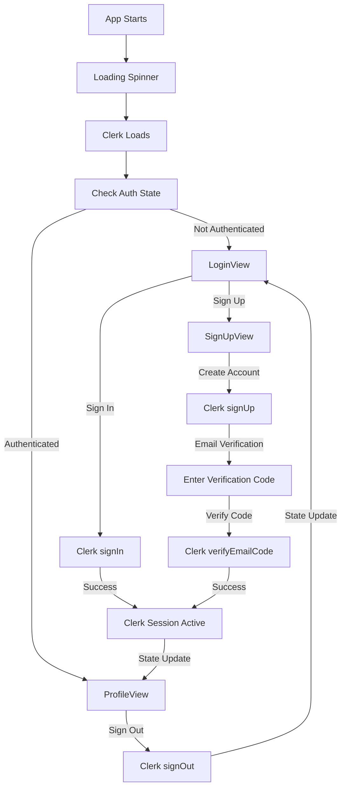

# Ionic Vue Clerk Authentication App

A production-ready Ionic Vue application with full Clerk authentication integration. This app provides a complete authentication system with login, signup, profile views, and comprehensive JSDoc documentation throughout the codebase.

## 🚀 Current Features

### Authentication System (Clerk Integration)
- **Login View** - Real Clerk authentication with email/password
- **Sign Up View** - User registration with email verification
- **Profile View** - User profile display with real Clerk user data
- **Route Protection** - Authentication-based navigation with Suspense
- **Email Verification** - Mobile-friendly email code verification
- **Session Management** - Automatic session refresh and state management

### Technical Features
- **Vue 3** - Modern reactive framework with Composition API
- **Ionic Vue** - Mobile-first UI framework with native components
- **TypeScript** - Fully typed with comprehensive JSDoc documentation
- **Vite** - Fast build tool and development server
- **Clerk Authentication** - Production-ready authentication service
- **Suspense Support** - Async component loading with fallback states
- **Mobile Optimized** - Capacitor-ready for iOS and Android

## 🛠️ Tech Stack

- **Vue 3** - Progressive JavaScript framework with Composition API
- **Ionic Vue** - Mobile-first UI framework with native components
- **TypeScript** - Type-safe JavaScript development with JSDoc
- **Vite** - Fast build tool and development server
- **Clerk** - Authentication and user management service
- **Capacitor** - Native mobile app runtime

## 📱 Platforms

- **Web** - Modern browsers (Chrome, Firefox, Safari, Edge)
- **iOS** - Native iOS app via Capacitor (iOS 13+)
- **Android** - Native Android app via Capacitor (API 21+)

### Mobile Development

This app is optimized for mobile development with Capacitor:

```bash
# Add iOS platform
npm run build
npx cap add ios
npx cap sync ios
npx cap open ios

# Add Android platform
npm run build
npx cap add android
npx cap sync android
npx cap open android
```

### Mobile-Specific Features

- **Email Code Verification**: Mobile-friendly authentication flow
- **Suspense Loading**: Proper loading states for mobile apps
- **Touch-Optimized UI**: Ionic components designed for touch interfaces
- **Native Performance**: Capacitor provides native app performance

## 🚀 Quick Start

### Prerequisites

- **Node.js** 18+ 
- **npm** or **yarn**

### Installation

1. **Install dependencies**
   ```bash
   npm install
   ```

2. **Set up environment variables (required for Clerk)**
   ```bash
   cp .env.example .env
   # Edit .env with your Clerk publishable key
   ```

3. **Run the development server**
   ```bash
   npm run dev
   ```

4. **Open in browser**
   - Navigate to `http://localhost:3000`
   - Test the Clerk authentication flow

## 🏗️ Project Architecture

### Component Structure

```
src/
├── main.ts                    # App entry point with Clerk setup
├── App.vue                    # Root component with Suspense
├── components/
│   ├── AppContent.vue         # Router outlet with auth protection
│   ├── AuthActions.vue        # Authentication action buttons
│   └── LoadingSpinner.vue     # Loading state component
├── composables/
│   ├── useAuth.ts             # Clerk authentication composable
│   └── useMobileAuth.ts       # Mobile-specific features
├── lib/
│   └── auth.ts                # Auth library exports
├── views/
│   ├── LoginView.vue          # Sign-in form with Clerk
│   ├── SignUpView.vue         # Registration form with verification
│   └── ProfileView.vue        # User profile display
├── router/
│   └── auth.ts                # Router configuration
└── theme/
    └── variables.css          # Ionic theme variables
```

### Authentication Flow



## 🧪 Testing the Authentication

### Test Scenarios

1. **Sign Up Flow**
   - Enter email, password, first name, last name
   - Click "Create Account"
   - Check email for verification code
   - Enter verification code to complete signup

2. **Email Verification Flow**
   - Enter verification code from email
   - Click "Verify Account"
   - Should redirect to profile page

3. **Sign In Flow**
   - Enter email and password
   - Click "Sign In"
   - Should redirect to profile page

4. **Sign Out Flow**
   - Click "Sign Out" button
   - Should redirect to login page

5. **Route Protection**
   - Try accessing `/profile` without being signed in
   - Should redirect to `/login`

6. **Session Management**
   - Test session refresh functionality
   - Test user profile retrieval
   - Test session info display

### Real User Data

The app uses real Clerk authentication:
- **Email**: Any valid email address
- **Password**: Must meet Clerk's password requirements
- **Verification Code**: Real code sent to your email
- **User Data**: Real user profile from Clerk

**Note:** This app uses email code verification instead of email links because it works better with mobile devices and Capacitor, avoiding cross-origin issues that can occur with email link verification.

## 🔧 Development

### Available Scripts

```bash
# Development server
npm run dev

# Build for production
npm run build

# Preview production build
npm run preview

# Lint code
npm run lint
```

### Authentication Composable

The `useAuth` composable provides Clerk authentication functionality:

```typescript
import { useAuth } from './composables/useAuth';

const {
  // State
  isSignedIn,    // Computed: true if user is signed in
  user,          // Computed: Clerk user object
  isLoaded,      // Computed: true when Clerk is loaded
  isLoading,     // Computed: true during auth operations
  error,         // Computed: current error message
  
  // Methods
  signIn,        // Clerk sign in with email/password
  signUp,        // Clerk sign up with email/password/name
  signOut,       // Clerk sign out
  handleVerification, // Clerk email verification
  getUserProfile, // Get current user profile
  getSession,    // Get current session info
  refreshSession, // Refresh current session
} = useAuth();
```

### JSDoc Documentation

The entire codebase includes comprehensive JSDoc documentation:

- **Function Documentation**: All functions have detailed parameter and return type documentation
- **Type Safety**: Full TypeScript support with proper type annotations
- **Component Documentation**: Vue components include detailed file-level documentation
- **Composable Documentation**: All composables have comprehensive API documentation
- **Error Handling**: Proper error handling with typed error objects

### Code Quality Standards

The project maintains high code quality standards:

- **Zero `any` Types**: All TypeScript code uses proper types instead of `any`
- **Comprehensive JSDoc**: Every function, class, and variable is documented
- **Type Safety**: Full TypeScript coverage with strict type checking
- **Error Handling**: Proper error handling with typed error objects
- **Consistent Formatting**: Code follows consistent formatting standards
- **Linting**: ESLint and TypeScript compiler ensure code quality

### JSDoc Examples

```typescript
/**
 * Signs in a user with email and password credentials.
 * @async
 * @param {string} email - User's email address
 * @param {string} password - User's password
 * @returns {Promise<boolean>} True if sign in was successful, false otherwise
 */
const signIn = async (email: string, password: string): Promise<boolean> => {
  // Implementation
};
```

## 🔧 Environment Configuration

### .env File Setup

The project includes a `.env.example` file with all necessary environment variables for Clerk integration:

```bash
# Copy the example file
cp .env.example .env

# Required: Clerk publishable key (get from https://dashboard.clerk.com/)
VITE_CLERK_PUBLISHABLE_KEY=pk_test_your_publishable_key_here

# Optional: Custom URLs and domains
VITE_CLERK_DOMAIN=your-custom-domain.clerk.accounts.dev
VITE_CLERK_SIGN_IN_URL=/login
VITE_CLERK_SIGN_UP_URL=/signup
VITE_CLERK_AFTER_SIGN_IN_URL=/profile
VITE_CLERK_AFTER_SIGN_UP_URL=/profile
```

**Important Notes:**
- Use `VITE_` prefix for environment variables (Vite requirement)
- Never commit `.env` files (they're in `.gitignore`)
- Restart dev server after changing environment variables
- Use `pk_test_` keys for development, `pk_live_` for production

## 📚 Code Quality Features

This production-ready app includes:

1. **Comprehensive JSDoc Documentation** - Every function, component, and variable is documented
2. **TypeScript Type Safety** - Full type coverage with no `any` types
3. **Error Handling** - Proper error handling throughout the application
4. **Mobile Optimization** - Capacitor-ready for iOS and Android deployment
5. **Suspense Support** - Async component loading with proper fallback states
6. **Real Authentication** - Production-ready Clerk integration

**Why Email Codes vs Email Links?**
- ✅ **Mobile-friendly** - Works seamlessly with Capacitor and mobile apps
- ✅ **No cross-origin issues** - Avoids `capacitor://localhost` vs `https://` protocol conflicts
- ✅ **Copy/paste friendly** - Users can easily copy codes from email
- ✅ **Offline capable** - Works once code is received, no browser dependency

## 🐛 Troubleshooting

### Common Issues

1. **App not loading**
   - Check if all dependencies are installed: `npm install`
   - Ensure Node.js version is 18+
   - Verify Clerk publishable key is set in `.env`

2. **Authentication not working**
   - Check browser console for errors
   - Verify Clerk publishable key is correct
   - Ensure all form fields are filled
   - Check Clerk dashboard for any configuration issues

3. **Route protection issues**
   - Check if `AppContent.vue` has the route protection logic
   - Verify the watcher is set up correctly
   - Ensure Clerk is fully loaded before navigation

4. **Email verification issues**
   - Check spam folder for verification emails
   - Verify email address is correct
   - Check Clerk dashboard for email delivery status

## 📄 License

This project is licensed under the MIT License.

## ✨ Key Features Summary

This production-ready Ionic Vue app with Clerk authentication includes:

### 🔐 Authentication
- **Real Clerk Integration** - Production-ready authentication service
- **Email Verification** - Mobile-friendly email code verification
- **Session Management** - Automatic session refresh and state management
- **Route Protection** - Authentication-based navigation with Suspense

### 📱 Mobile Ready
- **Capacitor Support** - Native iOS and Android app deployment
- **Touch-Optimized UI** - Ionic components designed for mobile
- **Suspense Loading** - Proper loading states for mobile apps
- **Cross-Platform** - Single codebase for web, iOS, and Android

### 🛠️ Code Quality
- **Comprehensive JSDoc** - Every function and component documented
- **TypeScript Type Safety** - Zero `any` types, full type coverage
- **Error Handling** - Proper error handling throughout
- **Linting** - ESLint and TypeScript compiler ensure quality

### 🏗️ Architecture
- **Vue 3 Composition API** - Modern reactive framework
- **Modular Design** - Clean separation of concerns
- **Reusable Composables** - Authentication logic in reusable functions
- **Component-Based** - Well-structured Vue components

## 👨‍💻 Author

**Aaron Saunders**
- GitHub: [@aaronksaunders](https://github.com/aaronksaunders)
- Email: aaron@clearlyinnovative.com

## 🙏 Acknowledgments

- [Ionic](https://ionicframework.com) for the mobile-first UI framework
- [Vue.js](https://vuejs.org) for the progressive JavaScript framework
- [Clerk](https://clerk.com) for the authentication service
- [Capacitor](https://capacitorjs.com) for the native mobile runtime