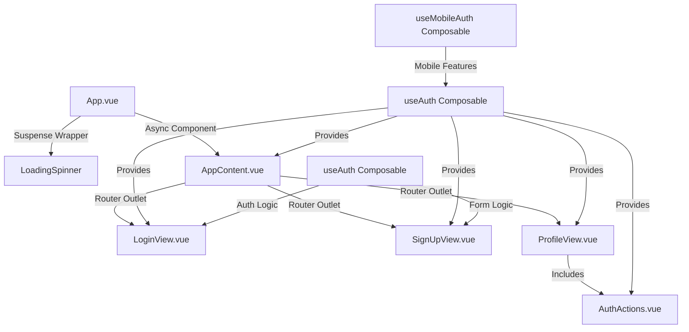
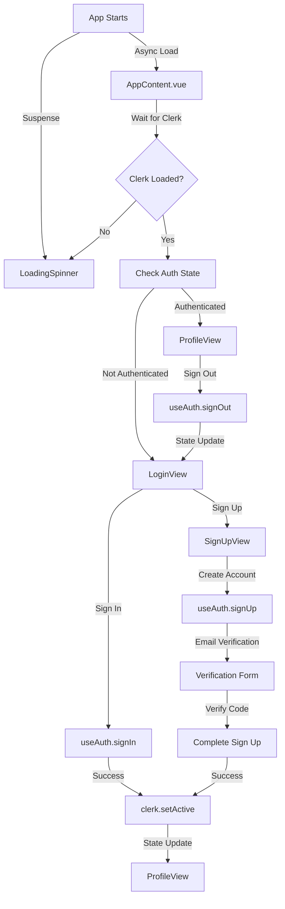
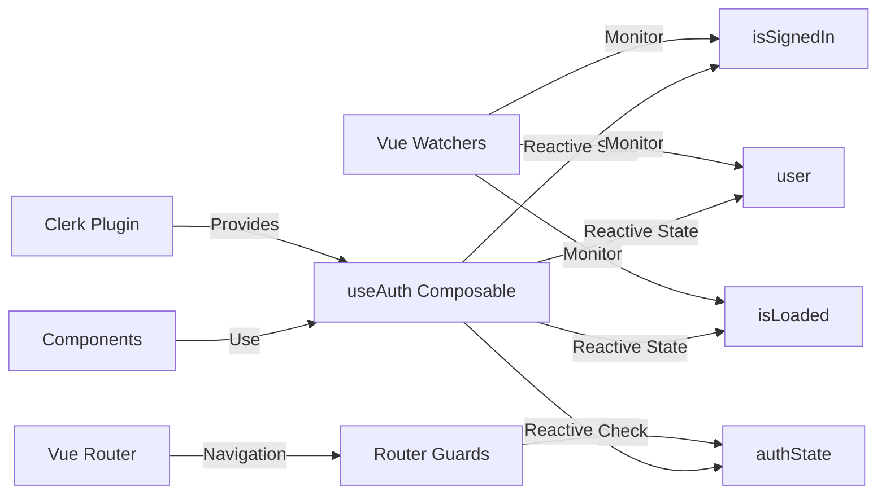
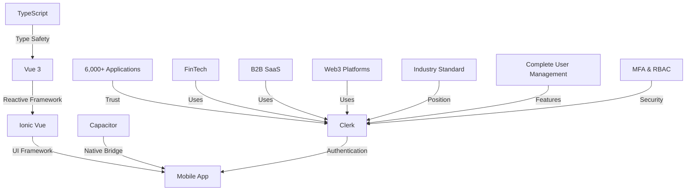
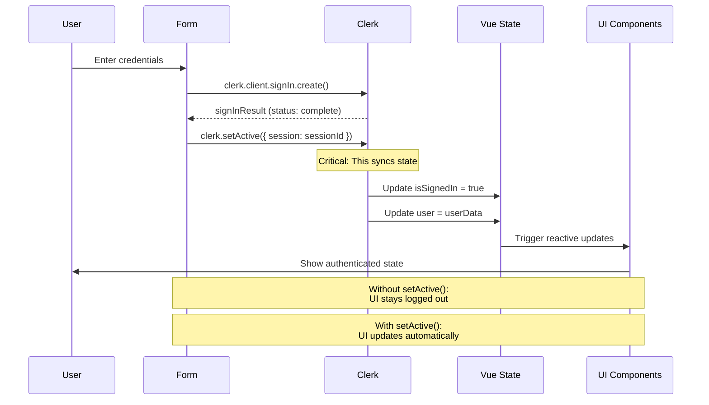
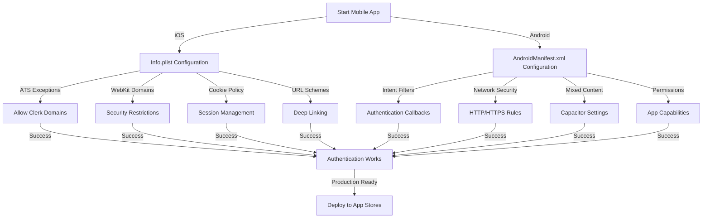

# Ionic Vue + Clerk Authentication - Basic Auth Template

A production-ready authentication template for Ionic Vue applications using Clerk's authentication service. This template provides a clean, mobile-optimized authentication flow with login, signup, and profile views, perfect for building real-world applications.

## 🚀 Features

### Authentication Views
- **Login View** - Clean sign-in form with email/password authentication
- **Sign Up View** - User registration with first name, last name, and email verification
- **Profile View** - User profile display with authentication actions
- **Protected Routes** - Automatic redirects based on authentication state

### Technical Features
- **Vue 3 + Suspense** - Modern async component loading with fallback states
- **Ionic Vue Router** - Native mobile navigation with proper back button handling
- **Clerk Headless Auth** - Full control over authentication UI and flow
- **Mobile-First Design** - Optimized for iOS and Android devices
- **TypeScript Support** - Type-safe development with comprehensive JSDoc
- **Production Ready** - Clean code, proper error handling, and security best practices

## 🛠️ Tech Stack

- **Vue 3** - Progressive JavaScript framework with Composition API
- **Ionic Vue** - Mobile-first UI framework with native components
- **Capacitor** - Native runtime for mobile apps (iOS/Android)
- **Clerk** - Authentication and user management service
- **TypeScript** - Type-safe JavaScript development
- **Vite** - Fast build tool and development server

## 📱 Platforms

- **Web** - Modern browsers (Chrome, Firefox, Safari, Edge)
- **iOS** - Native iOS app via Capacitor (iOS 13+)
- **Android** - Native Android app via Capacitor (API 21+)

## 🚀 Quick Start

### Prerequisites

- **Node.js** 18+ 
- **npm** or **yarn**
- **iOS Simulator** (for iOS development)
- **Android Studio** (for Android development)
- **Clerk Account** - Sign up at [clerk.com](https://clerk.com)

### Installation

1. **Clone the repository**
   ```bash
   git clone <repository-url>
   cd clerk-ionic-vue-app
   ```

2. **Install dependencies**
   ```bash
   npm install
   ```

3. **Set up Clerk authentication**
   - Create a new application in your [Clerk Dashboard](https://dashboard.clerk.com)
   - Copy your publishable key
   - Create a `.env` file in the project root:
     ```bash
     cp .env.example .env
     ```
   - Update `.env` with your publishable key:
     ```env
     VITE_CLERK_PUBLISHABLE_KEY=pk_test_your_publishable_key_here
     ```

4. **Run the development server**
   ```bash
   npm run dev
   ```

5. **Open in browser**
   - Navigate to `http://localhost:3000`
   - Test the authentication flow

### Mobile Development

#### iOS Setup

1. **Add iOS platform**
   ```bash
   npx cap add ios
   ```

2. **Build and sync**
   ```bash
   npm run build
   npx cap sync ios
   ```

3. **Open in Xcode**
   ```bash
   npx cap open ios
   ```

4. **Run on simulator**
   ```bash
   npx cap run ios
   ```

#### Android Setup

1. **Add Android platform**
   ```bash
   npx cap add android
   ```

2. **Build and sync**
   ```bash
   npm run build
   npx cap sync android
   ```

3. **Open in Android Studio**
   ```bash
   npx cap open android
   ```

4. **Run on device/emulator**
   ```bash
   npx cap run android
   ```

## 🏗️ Project Architecture

### Component Structure



### Authentication Flow



### State Management



### Tech Stack Architecture



### State Synchronization Solution



### Platform Configuration Flow



## 📱 Platform-Specific Configuration

### iOS Configuration

#### Info.plist Setup

The iOS app requires specific configuration in `ios/App/App/Info.plist` for proper authentication:

```xml
<!-- App Transport Security Configuration -->
<key>NSAppTransportSecurity</key>
<dict>
  <key>NSAllowsArbitraryLoads</key>
  <true/>
  <key>NSAllowsArbitraryLoadsInWebContent</key>
  <true/>
  <key>NSAllowsLocalNetworking</key>
  <true/>
  <key>NSExceptionDomains</key>
  <dict>
    <key>clerk.accounts.dev</key>
    <dict>
      <key>NSExceptionAllowsInsecureHTTPLoads</key>
      <true/>
      <key>NSExceptionMinimumTLSVersion</key>
      <string>TLSv1.0</string>
      <key>NSIncludesSubdomains</key>
      <true/>
    </dict>
    <key>clerk.com</key>
    <dict>
      <key>NSExceptionAllowsInsecureHTTPLoads</key>
      <true/>
      <key>NSExceptionMinimumTLSVersion</key>
      <string>TLSv1.0</string>
      <key>NSIncludesSubdomains</key>
      <true/>
    </dict>
  </dict>
</dict>

<!-- WebKit App Bound Domains -->
<key>WKAppBoundDomains</key>
<array>
  <string>your-clerk-domain.clerk.accounts.dev</string>
</array>

<!-- Cookie Support for Session Management -->
<key>NSURLSessionConfiguration</key>
<dict>
  <key>NSHTTPCookieAcceptPolicy</key>
  <string>NSHTTPCookieAcceptPolicyAlways</string>
</dict>
```

#### Common iOS Issues

1. **Module Cache Path Mismatch**
   ```bash
   # Clear DerivedData when project is renamed/moved
   rm -rf ios/DerivedData
   npx cap sync ios
   ```

2. **Build Failures**
   ```bash
   # Clean and rebuild
   npx cap clean ios
   npx cap sync ios
   npx cap run ios
   ```

### Android Configuration

#### AndroidManifest.xml Setup

The Android app requires specific permissions and network configuration:

```xml
<!-- Required permissions -->
<uses-permission android:name="android.permission.INTERNET" />
<uses-permission android:name="android.permission.ACCESS_NETWORK_STATE" />

<!-- Network security configuration -->
<application
    android:usesCleartextTraffic="true"
    android:networkSecurityConfig="@xml/network_security_config"
    ...>
```

#### Network Security Configuration

Create `android/app/src/main/res/xml/network_security_config.xml`:

```xml
<?xml version="1.0" encoding="utf-8"?>
<network-security-config>
    <domain-config cleartextTrafficPermitted="true">
        <domain includeSubdomains="true">clerk.accounts.dev</domain>
        <domain includeSubdomains="true">clerk.com</domain>
        <domain includeSubdomains="true">api.clerk.com</domain>
    </domain-config>
    
    <!-- For development only - remove in production -->
    <base-config cleartextTrafficPermitted="true">
        <trust-anchors>
            <certificates src="system"/>
        </trust-anchors>
    </base-config>
</network-security-config>
```

#### Capacitor Configuration

Update `capacitor.config.ts` for Android:

```typescript
const config: CapacitorConfig = {
  appId: "io.ionic.starter",
  appName: "clerk-ionic-vue-app",
  webDir: "dist",
  server: {
    androidScheme: "https",
    iosScheme: "https",
  },
  plugins: {
    CapacitorCookies: {
      enabled: true,
    },
  },
  android: {
    allowMixedContent: true,
    captureInput: true,
  },
};
```

## 🔧 Development

### Project Structure

```
src/
├── main.ts                    # App entry point with Clerk configuration
├── App.vue                    # Root component with Suspense
├── components/
│   ├── AppContent.vue         # Main app content (async component)
│   ├── AuthActions.vue        # Shared authentication actions
│   └── LoadingSpinner.vue     # Loading fallback component
├── composables/
│   ├── useAuth.ts             # Core authentication logic
│   └── useMobileAuth.ts       # Mobile-specific features
├── views/
│   ├── LoginView.vue          # Sign-in form
│   ├── SignUpView.vue         # Registration form
│   └── ProfileView.vue        # User profile display
├── router/
│   └── auth.ts                # Router configuration
└── theme/
    └── variables.css          # Ionic theme variables
```

### Key Files

- **`src/main.ts`** - Clerk configuration and app initialization
- **`src/App.vue`** - Suspense wrapper with async component loading
- **`src/composables/useAuth.ts`** - Core authentication composable
- **`src/views/LoginView.vue`** - Sign-in form implementation
- **`src/views/SignUpView.vue`** - Registration form implementation
- **`src/views/ProfileView.vue`** - User profile display
- **`capacitor.config.ts`** - Capacitor configuration

### Authentication Composable

The `useAuth` composable provides all authentication functionality:

```typescript
import { useAuth } from './composables/useAuth';

const {
  // State
  isSignedIn,
  user,
  isLoaded,
  isLoading,
  error,
  authState,
  
  // Methods
  signIn,
  signUp,
  signOut,
  getToken,
  getUserProfile,
  getSessionInfo,
  refreshSession
} = useAuth();
```

## 🧪 Testing

### Web Testing
```bash
npm run dev
# Open http://localhost:3000
```

### Mobile Testing
```bash
# iOS
npx cap run ios

# Android
npx cap run android
```

### Unit Testing
```bash
npm run test
```

## 📦 Building for Production

### Web Build
```bash
npm run build
```

### Mobile Builds
```bash
# Build web assets
npm run build

# Sync with native projects
npx cap sync

# Build native apps
npx cap build ios
npx cap build android
```

## 🔒 Security Features

### JWT Token Management
- **Secure Storage** - Tokens stored in platform-specific secure storage
- **Automatic Refresh** - Tokens refreshed before expiration
- **Secure Transmission** - All API calls use HTTPS
- **Proper Cleanup** - Tokens securely removed on sign-out

### Mobile Security
- **iOS Keychain** - Native secure storage using iOS Keychain Services
- **Android Keystore** - Hardware-backed secure storage on Android
- **App Sandboxing** - Tokens isolated within app's secure container

## 🐛 Troubleshooting

### Common Issues

1. **Clerk not initialized**
   - Check your publishable key in `.env`
   - Ensure Clerk dashboard is properly configured

2. **Mobile build failures**
   - Clear DerivedData: `rm -rf ios/DerivedData`
   - Run `npx cap sync` after configuration changes
   - Check platform-specific configuration files

3. **Authentication not working on mobile**
   - Verify Info.plist/AndroidManifest.xml configuration
   - Check network security settings
   - Ensure `clerk.setActive()` is called after authentication

4. **Module cache path errors**
   - Clear build cache: `rm -rf ios/DerivedData`
   - Sync Capacitor: `npx cap sync ios`

### Debug Mode

Enable debug logging by checking browser dev tools console for detailed Clerk API responses.

## 📚 Documentation

- [Clerk Vue Documentation](https://clerk.com/docs/quickstarts/vue)
- [Ionic Vue Documentation](https://ionicframework.com/docs/vue/overview)
- [Capacitor Documentation](https://capacitorjs.com/docs)
- [Vue 3 Suspense Guide](https://vuejs.org/guide/built-ins/suspense.html)

## 🤝 Contributing

1. Fork the repository
2. Create a feature branch
3. Make your changes
4. Add tests if applicable
5. Submit a pull request

## 📄 License

This project is licensed under the MIT License - see the LICENSE file for details.

## 👨‍💻 Author

**Aaron Saunders**
- GitHub: [@aaronksaunders](https://github.com/aaronksaunders)
- Email: aaron@clearlyinnovative.com

## 🙏 Acknowledgments

- [Clerk](https://clerk.com) for the excellent authentication service
- [Ionic](https://ionicframework.com) for the mobile-first UI framework
- [Vue.js](https://vuejs.org) for the progressive JavaScript framework