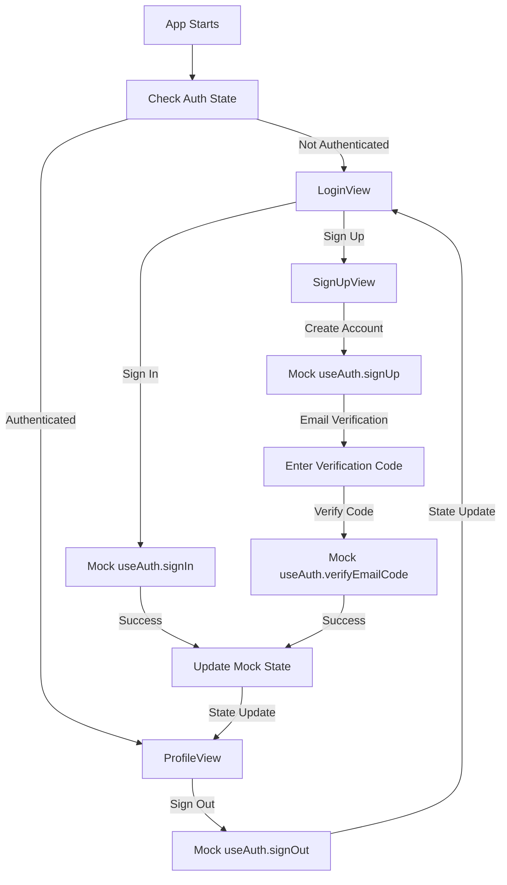

# Ionic Vue Tutorial App - Starting Point

A basic Ionic Vue application with mock authentication, designed as a starting point for learning how to integrate Clerk authentication. This app provides a clean foundation with login, signup, and profile views using mock authentication that can be replaced with real Clerk integration.

## 🚀 Current Features

### Authentication Views (Mock Implementation)
- **Login View** - Sign-in form with mock authentication
- **Sign Up View** - User registration form with mock validation
- **Profile View** - User profile display with mock user data
- **Route Protection** - Basic authentication-based navigation

### Technical Features
- **Vue 3** - Modern reactive framework with Composition API
- **Ionic Vue** - Mobile-first UI framework with native components
- **TypeScript** - Type-safe development
- **Vite** - Fast build tool and development server
- **Mock Authentication** - Simulated auth for tutorial purposes

## 🛠️ Tech Stack

- **Vue 3** - Progressive JavaScript framework
- **Ionic Vue** - Mobile-first UI framework
- **TypeScript** - Type-safe JavaScript development
- **Vite** - Fast build tool and development server

## 📱 Platforms

- **Web** - Modern browsers (Chrome, Firefox, Safari, Edge)
- **iOS** - Native iOS app via Capacitor (iOS 13+)
- **Android** - Native Android app via Capacitor (API 21+)

## 🚀 Quick Start

### Prerequisites

- **Node.js** 18+ 
- **npm** or **yarn**

### Installation

1. **Install dependencies**
   ```bash
   npm install
   ```

2. **Run the development server**
   ```bash
   npm run dev
   ```

3. **Open in browser**
   - Navigate to `http://localhost:3000`
   - Test the mock authentication flow

## 🏗️ Project Architecture

### Component Structure

```
src/
├── main.ts                    # App entry point
├── App.vue                    # Root component with route protection
├── components/
│   └── AuthActions.vue        # Mock authentication actions
├── composables/
│   ├── useAuth.ts             # Mock authentication logic
│   └── useMobileAuth.ts       # Mock mobile features
├── views/
│   ├── LoginView.vue          # Sign-in form (mock)
│   ├── SignUpView.vue         # Registration form (mock)
│   └── ProfileView.vue        # User profile display (mock)
├── router/
│   └── auth.ts                # Router configuration
└── theme/
    └── variables.css          # Ionic theme variables
```

### Mock Authentication Flow



## 🧪 Testing the Mock Auth

### Test Scenarios

1. **Sign Up Flow**
   - Enter email, password, first name, last name
   - Click "Create Account"
   - Should show verification code form

2. **Email Verification Flow**
   - Enter verification code from email (use "123456" for testing)
   - Click "Verify Code"
   - Should redirect to profile page

3. **Sign In Flow**
   - Enter email and password
   - Click "Sign In"
   - Should redirect to profile page

4. **Sign Out Flow**
   - Click "Sign Out" button
   - Should redirect to login page

5. **Route Protection**
   - Try accessing `/profile` without being signed in
   - Should redirect to `/login`

### Mock User Data

The mock authentication uses these test credentials:
- **Email**: Any valid email format
- **Password**: Any non-empty password
- **Verification Code**: Use "123456" for testing (mock always accepts this code)
- **Special**: Use email containing "verify" to test email verification flow

**Note:** This tutorial uses email code verification instead of email links because it works better with mobile devices and Capacitor, avoiding cross-origin issues that can occur with email link verification.

## 🔧 Development

### Available Scripts

```bash
# Development server
npm run dev

# Build for production
npm run build

# Preview production build
npm run preview

# Lint code
npm run lint
```

### Mock Authentication Composable

The `useAuth` composable provides mock authentication functionality:

```typescript
import { useAuth } from './composables/useAuth';

const {
  // State
  isSignedIn,    // Computed: true if user is signed in
  user,          // Computed: mock user object
  isLoaded,      // Computed: always true (mock)
  
  // Methods
  signIn,        // Mock sign in
  signUp,        // Mock sign up
  signOut,       // Mock sign out
  verifyEmailCode, // Mock email verification
  resendVerificationEmail, // Mock resend verification
  refresh,       // Mock session refresh
} = useAuth();
```

## 📚 Next Steps

This tutorial app is designed to be the starting point for learning Clerk integration. Follow the tutorial to:

1. **Install Clerk** - Add Clerk dependencies
2. **Configure Clerk** - Set up authentication service
3. **Replace Mock Auth** - Swap mock functions for real Clerk
4. **Add Email Code Verification** - Implement real email verification (mobile-friendly)
5. **Add Suspense** - Implement production-ready loading states

**Why Email Codes vs Email Links?**
- ✅ **Mobile-friendly** - Works seamlessly with Capacitor and mobile apps
- ✅ **No cross-origin issues** - Avoids `capacitor://localhost` vs `https://` protocol conflicts
- ✅ **Copy/paste friendly** - Users can easily copy codes from email
- ✅ **Offline capable** - Works once code is received, no browser dependency

## 🐛 Troubleshooting

### Common Issues

1. **App not loading**
   - Check if all dependencies are installed: `npm install`
   - Ensure Node.js version is 18+

2. **Mock auth not working**
   - Check browser console for errors
   - Ensure all form fields are filled

3. **Route protection issues**
   - Check if `App.vue` has the route protection logic
   - Verify the watcher is set up correctly

## 📄 License

This project is licensed under the MIT License.

## 👨‍💻 Author

**Aaron Saunders**
- GitHub: [@aaronksaunders](https://github.com/aaronksaunders)
- Email: aaron@clearlyinnovative.com

## 🙏 Acknowledgments

- [Ionic](https://ionicframework.com) for the mobile-first UI framework
- [Vue.js](https://vuejs.org) for the progressive JavaScript framework